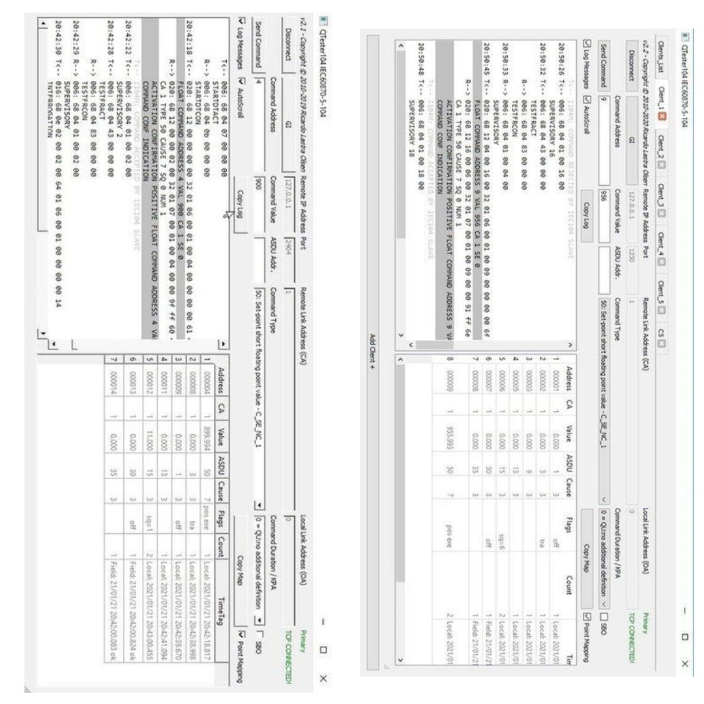

# QTester_IEC104  

## About the Software:
This software implements the IEC60870-5-104 protocol (client side) for substation data acquisition and control via tcp/ip network using the QT UI Framework. The Software is compiles with QT 4.11.2 (Community).This software implements an IEC 60870-5-104 protocol tester.
IEC 60870-5-104 is a commonly used protocol for data acquisition and control of power substations.

It can be used to poll substation data and issuing commands.
The base protocol classes are pure C++ without any platform or non-standard library dependencies, can be used to develop software with other compiler/library/sdk.
The software is part of a full substation HMI project (OSHMI - Open Substation HMI), it functions as a protocol module for the HMI, but can be used as a standalone protocol tester.

## Getting Started:
It's possible to send a General Interrogation (**GI** button) and log messages on the screen. 
At the right panel is shown a table with the following data columns:
Protocol [**Address**] | Last acquired [**Value**] | ASDU [**Type**] | [**Cause**] of transmission | Quality [**Flags**] | [**Count**] of transmissions.

The protocol quality flags are:
+ **on / off / tra:** double point transition
+ **ind:** double point indefinite
+ **bl:** blocked
+ **iv:** invalid
+ **nt:** not topical
+ **sb:** substituted
+ **ov:** overflow.
+ **t:** reg.step transition.

An optional configuration file can be used to store basic parameters, in the form of a INI file (qtester104.ini):

[BDTR] 
; 0 (default): Normal operation mode 
; 1: Force to be primary when in redundant mode 
; FORCE_PRIMARY=1 

[IEC104]  
PRIMARY_ADDRESS=1        ; link address of the primary station (computer) 

[RTU1]                   ; communicates with only one RTU in this version 
Name = ...               ; Name of the Client  
SECONDARY_ADDRESS=2      ; protocol link address of the RTU 
IP_ADDRESS=192.168.1.1   ; IP address of the RTU 
; IP_ADDRESS_BACKUP=192.168.1.2   ; IP address of the BACKUP RTU 
ALLOW_COMMANDS=1         ; 1=allow sending commands, 0=don't permit commands 
; PORT=2404              ; Protocol port (default=2404) 
; GI_PERIOD = 330        ; time period in seconds for general interrogations (default=330s) 

[RTU2] 
Name = Client2 
SECONDARY_ADDRESS=1 
IP_ADDRESS= 127.0.0.1 
; IP_ADDRESS_BACKUP=192.168.1.2 
TCP_PORT=2405 
ALLOW_COMMANDS=1 

## Insight into new implementation:
+ Possibility to open more than one client in one instance. 
    >This can be prepared on the one hand with the Conf file (just add RTU1, RTU2 ... sections  to the ini file in the Conf Folder) or via the button **+ Add Client**.This button enables the client name, port number and IP address of the new client to be entered. These are also automatically entered in the corresponding tab.
+ Welcome page in which all clients are entered. 
+ Forwarding to the client or tab by double-clicking on the row in the widget table.  
+ Automatic point mapping.  
+ Closable tabs(Clients).

## Built and Compile:
You have to take the following steps to start the software as an executable App:

1. please install the QT software with the compilation packages QT 5.13.2 32bit or 64 bit...
2. open the source code with the Qt software and compile in a specific build directory. This will help you to find the compiled Qtester104.exe faster.
3. take the software (Qtester 104.exe) and put it in a folder with the following binary files: (before you ask yourself where you can find the binary files ==> 
    you can find it in the directory where you installed your software: for example " C:\Qt\5.13.2\mingw73_32\bin "
    + libgcc_s_dw2-1.dll
    + libstdc++-6.dll
    + Qt5Cored.dll
    + Qt5Gui.dll
    + Qt5Guid.dll
    + Qt5Networkd.dll
    + Qt5Widgetsd.dll
    + qwindowsd.dll
4. find these files and copy them into the same folder as the Qtester104.exe and now it should work...

## Directories:
+ ***Source_Code:*** multiplatform qt sources, compile with QT 5.13.1 or later on any supported platform.
+ ***Conf:*** configuration file. It can be used to store basic parameters, in the form of a INI file 

## License and Copyright:

QTester104 Copyright © 2010-2019 Ricardo L. Olsen.
>This program is free software: you can redistribute it and/or modify
>it under the terms of the GNU General Public License as published by
>the Free Software Foundation, either version 3 of the License, or
>(at your option) any later version.
>This program is distributed in the hope that it will be useful,
>but WITHOUT ANY WARRANTY; without even the implied warranty of
>MERCHANTABILITY or FITNESS FOR A PARTICULAR PURPOSE.  See the
>GNU General Public License for more details.
>You should have received a copy of the GNU General Public License
>along with this program.  If not, please see <http://www.gnu.org/licenses/>.
    

Thank you for the interest, please fell free to comment and contribute.

>THE SOFTWARE IS PROVIDED "AS IS", WITHOUT WARRANTY OF ANY KIND,
>EXPRESS OR IMPLIED, INCLUDING BUT NOT LIMITED TO THE WARRANTIES
>OF MERCHANTABILITY, FITNESS FOR A PARTICULAR PURPOSE AND NONINFRINGEMENT.
>IN NO EVENT SHALL THE AUTHORS OR COPYRIGHT HOLDERS BE LIABLE FOR ANY CLAIM,
>DAMAGES OR OTHER LIABILITY, WHETHER IN AN ACTION OF CONTRACT, TORT OR
>OTHERWISE, ARISING FROM, OUT OF OR IN CONNECTION WITH THE SOFTWARE OR
>THE USE OR OTHER DEALINGS IN THE SOFTWARE.
 
Link to the original software: https://sourceforge.net/projects/qtester104/. 

